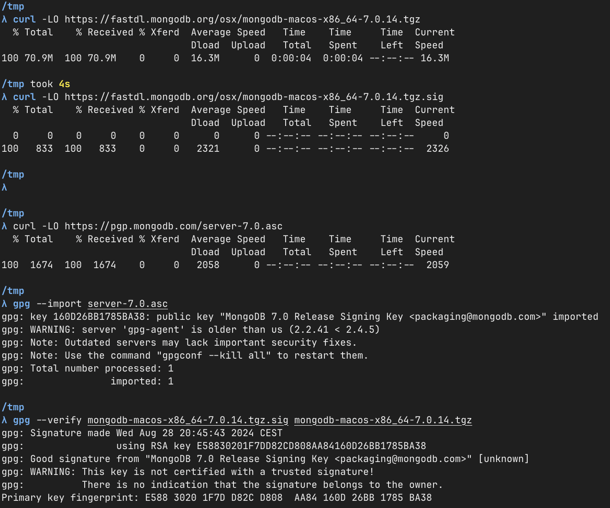
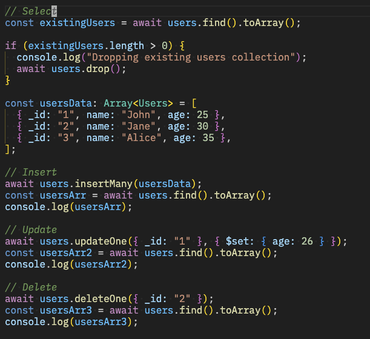

<!-- Technical problems that you encountered during installation and use of MongoDB and how you resolved

Screenshots for:

The correct validation of the installation package (https://docs.mongodb.com/manual/tutorial/verify-mongodb-packages/)

Relevant results obtained during Experiment 1 (it is not necessary to put a single screenshot on each substep, but at least one significant from each CRUD operation).

Experiment 2 example working and the additional Map-reduce operation (and its result) developed by each of you.

Reason about why your implemented Map-reduce operation in Experiment 2 is useful and interpret the collection obtained.

Any pending issues with this assignment which you did not manage to solve -->

# Dat250 Assignment 5

## Tehnical problems

I had no errors during the installation of MongoDB.

Screenshot of the validation of the installation package:

## Experiment 1

### CRUD operations

## Experiment 2

I didn't understand at first that the code example was using the `mongo` shell as it looked super similar to JavaScript, but then I read the instructions a bit closer and tried it in the shell and it worked.

I also did some map-reduce operations in JS using Deno, which was a bit more familiar to me. I think they recommend using aggeration pipelines, so that is what I did. Look inside of `main.ts` for the full code. Requires Deno to run, with `deno -A main.ts`.

Map-reduce is useful for aggregating data in a collection. Works pretty similar to the `Array.prototype.reduce` function in JavaScript.

## Pending issues

No pending issues.
